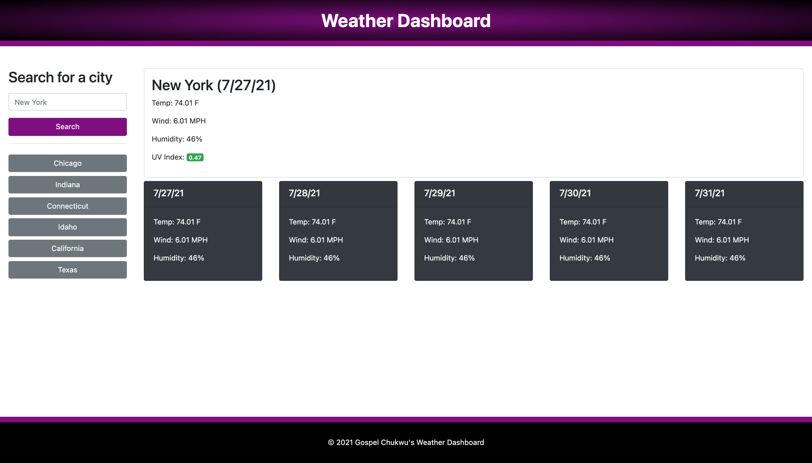

# HW6 Server-Side APIs - Weather Dashboard - Project

## Project Description

With resources from a severside weather API, this project should show us the accurate weather conditions for any given city entered and the result should display a 5 day weather forcast. This project will be developed using HTML5, CSS3, Bootstrap, jQuery and Server side weather API.

---

## Table of Content

1. [Project Description](https://github.com/ozeddis/hw6-weather-dashboard#project-description)
2. [Author Info](https://github.com/ozeddis/hw6-weather-dashboard#author-info)
3. [User Story](https://github.com/ozeddis/hw6-weather-dashboard#user-story)
4. [Acceptance Criteria](https://github.com/ozeddis/hw6-weather-dashboard#acceptance-criteria)
5. [Mock-Up Preview](https://github.com/ozeddis/hw6-weather-dashboard#mock-up-preview)
6. [Useful Links](https://github.com/ozeddis/hw6-weather-dashboard#useful-links)
7. [Tech Stack](https://github.com/ozeddis/hw6-weather-dashboard#tech-stack)
8. [Credits](https://github.com/ozeddis/hw6-weather-dashboard#credits)
9. [Licence](https://github.com/ozeddis/hw6-weather-dashboard#licence)

---

## Author Info

Name: Ozoemena Ifeanyi

Email: ozeddissystems@gmail.com

Portfolio: coming soon

---

## User Story

```
AS A traveler
I WANT to see the weather outlook for multiple cities
SO THAT I can plan a trip accordingly
```

---

## Acceptance Criteria

```
GIVEN a weather dashboard with form inputs
WHEN I search for a city
THEN I am presented with current and future conditions for that city and that city is added to the search history
WHEN I view current weather conditions for that city
THEN I am presented with the city name, the date, an icon representation of weather conditions, the temperature, the humidity, the wind speed, and the UV index
WHEN I view the UV index
THEN I am presented with a color that indicates whether the conditions are favorable, moderate, or severe
WHEN I view future weather conditions for that city
THEN I am presented with a 5-day forecast that displays the date, an icon representation of weather conditions, the temperature, the wind speed, and the humidity
WHEN I click on a city in the search history
THEN I am again presented with current and future conditions for that city
```

---

## Mock-Up Preview

The following image shows the web application's appearance and functionality:



---

## Useful Links

1. 🗂 [Click me to view github repository for this project](https://github.com/ozeddis/hw6-weather-dashboard/)
2. 🌍 [Click me to view deployed application on github pages](https://ozeddis.github.io/hw6-weather-dashboard/)

---

## Tech Stack


---

Thanks to [OpenWeather One Call API](https://openweathermap.org/api/one-call-api) for making this Server side API free and available to us!

---

## Licence

MIT
